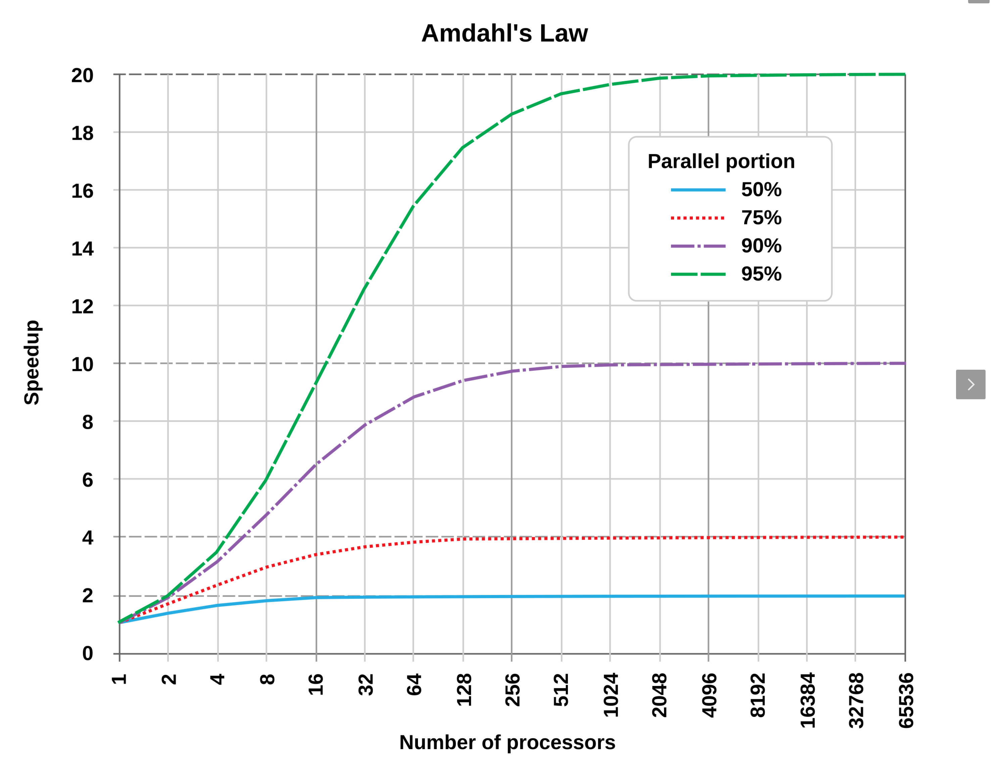

# 並行/並列処理基礎
このセクションでは主要なライブラリについて解説します。
- 並列処理とは？ "何が嬉しいの？"
- Pythonで並列処理 "並列処理の種類と違いは？"
- コルーチンとNon-blocking "I/O "マルチスレッドとの違いは？"
- Pythonでコルーチンの実装　"非同期処理とは？"
- マルチスレッド処理とBlocking I/O "非同期と並行処理の違いは？"
- スレッドセーフ "並列処理を安全に実装するためには？"
- アムダールの法則 "並列化によってどれくらいプログラムが高速になるのか？"
- コルーチン(スレッド)間での値の受け渡し

並列処理は意外と穴が多い分野です。
ここで工学系の大学３年レベルの入門的な知識を、実際に手を動かしつつ修得することを目的とします。

## 並行/並列処理
並行処理とは、計算機のリソースを効率的に利用することで計算速度を速めることを指します。
一方、並列処理とは、複数の計算を同時に実行することを指します。
並行処理と並列処理は似たような字面ですが、概念や実装は相当に異なります。

並行/並列処理の逆は逐次です。逐次処理は、タスクを一つずつ順番に処理する方法です。
逐次処理では、各タスクが完了するまで次のタスクが開始されません。
そのため、タスクの実行時間はそれぞれのタスクの時間の合計となり、並列処理と比較して処理速度が低下することが多いです。(必ずしも早くなるわけではないことをあとで説明します。)


## Pythonで並行/並列処理

今回のhandsonでは[asyncio](https://docs.python.org/ja/3/library/asyncio.html)を用います。
asyncioはPythonで並列処理を実現するためのライブラリです。
asyncioはシングルスレッド内で並列処理を行っています。
並列処理と聞くと、一般にマルチスレッドやマルチプロセスを想像すると思います。
しかし、コルーチンという仕組みを使うとシングルスレッド内で並列処理が可能です。
コルーチンについてはあとで説明します。

Pythonでは、ほかにも以下の方法で並列処理を実現できます：
- `threading.Thread`: スレッドを使用して並列処理を行います。
- `multiprocessing.Process`: プロセスを使用して並列処理を行います。
- `concurrent.futures`: 高レベルのインターフェースを提供し、スレッドまたはプロセスプールを使用して並列処理を簡単に実装できます。
- `asyncio`: 非同期I/O操作を効率的に処理するためのライブラリで、シングルスレッド内での並行処理を実現します。

これらの方法を使用することで、Pythonで効率的な並列処理を実現することができます。


## コルーチンとNon-blocking I/O　 (並行処理)
シングルスレッド内で並列処理を実現するためにはコルーチンという概念を理解する必要があります。
コルーチンはよくマルチスレッド処理と比較されます。以下は簡単な比較例です。

コルーチン
- シングルスレッド: コルーチンはシングルスレッド内で実行され、イベントループによって管理されます。
- 非同期I/Oに最適: コルーチンはI/Oバウンドのタスク（ネットワーク操作やファイル操作など）に最適です。
- 軽量: スレッドに比べて軽量で、コンテキストスイッチのオーバーヘッドが少ないです。
- 協調的マルチタスク: コルーチンは明示的にawaitを使用して他のタスクに明示的に制御を渡します。

マルチスレッド
- マルチスレッド: マルチスレッドは複数のスレッドを使用して並列にタスクを実行します。
- CPUバウンドのタスクに適: マルチスレッドはCPUバウンドのタスク（計算集約型の処理など）に適しています。
- 重い: スレッドはコルーチンに比べて重く、コンテキストスイッチのオーバーヘッドが大きいです。
- プリエンプティブマルチタスク: スレッドはOSによってスケジューリングされ、明示的に制御を渡す必要はありません。

コルーチンを理解するためには、まずコルーチン（または一般的なプロセス）には3つの状態があることを理解する必要があります。

- 実行中(Running)...処理がスレッドに割り当てられ、実行されている状態です。
- ブロック中(Blocking)...ファイルのreadやnetworkの待ち状態など、次の処理を待っている状態です。処理がスレッドに乗っていない状態です。
- 実行待ち(Pending)...Block中で待っていた処理が届き、次の処理がいつでも実行可能な状態。

通常は、実行中->ブロック中->実行待ち->実行中->...とプロセスが終了するまで無限にループします。

さて、コルーチンにも同じことが言えます。例えば以下のコードを見てみます。
```python
import time

def read_file(n):
    print('読み込みスタート:', n)
    time.sleep(1) # 何か重いファイルを読み込んでいると仮定
    print('読み込み終了:', n)

read_file(1)
read_file(2)
read_file(3)
```
この場合、合計で3秒かかります。
しかし、ファイル読み込みの場合、実行スレッドはSSDやハードディスクからデータが転送されるのを待っている状態がほとんどです。
したがって、実行スレッドはほぼ3秒間ブロック中(Blocking)です。このようなブロックをI/O blockingと言います。

さあ、ここでブロック中(I/O blocking)中に違う処理ができたら嬉しくないですか？
そこでコルーチンという概念があります。
コルーチンを使うとスレッドをブロックしない代わりに、違う処理を実行することができます。
このような概念を非同期と言います。
そして非同期を実現するコアな仕組みがNon-blocking I/Oです。

言葉で説明してもわかりづらいので、実際コードを見ながら理解していきましょう。

## Pythonでコルーチンの実装
コルーチンは、asyncio の非同期タスクの実行単位です。
コルーチンは、`async`キーワードを使用して定義され、`await`キーワードを使用して他のコルーチンや非同期操作を待機することができます。

コルーチンの基本的な使い方は以下の通りです：


```python
import asyncio

async def say_hello():
    print('Hello')
    await asyncio.sleep(1)
    print('World')

# コルーチンをイベントループで実行
asyncio.run(say_hello())
```
この例では、say_hello コルーチンが定義され、await asyncio.sleep(1) によって1秒間待機します。この間、イベントループは他のタスクを実行することができます。

つぎにコルーチンを用いて並列処理を実行してみます。
```python
import asyncio

async def func1():
    print('func1() started')
    await asyncio.sleep(1)
    print('func1() finished')

async def func2():
    print('func2() started')
    await asyncio.sleep(1)
    print('func2() finished')

async def main():
    task1 = asyncio.create_task(func1())
    task2 = asyncio.create_task(func2())
    await task1
    await task2

asyncio.run(main())
```
実行してみると約1秒で処理が終了します。
このようにfunc1, func2をコルーチンとして包み、並列処理を行っています。
そして ``` task = asyncio.create_task()```を呼び出すことで、コルーチンオブジェクトを生成し```await task ```を呼び出すことで、コルーチンを実行します。

awaitの目的は、処理が終了するまで、ほかのタスク（コルーチン）に実行権利（制御権利）を移す、ということです。この場合、```await asyncio.sleep(1)```で1秒処理を止める、ということを明示的に記述しています。言い換えればこれは1秒間ほかのコルーチンにスレッドの制御を譲るということを意味します。
ファイルからデータを読み込む処理を```await readLine()```とします。この場合、ディスクからファイルのデータを読み込むためI/O blockingが発生します。コルーチンでは、このI/O blocking中にほかのコルーチンにスレッドの制御権利を移します。

```await asyncio.sleep(1)```に戻りましょう。似たような関数として`time.sleep(1)`があります。これも一秒間処理を停止する処理ですがコルーチン用ではありません。したがってほかのコルーチンに制御権利を渡しません。

まとめ。`await/async`で制御権利をコントロールすることが大切です。
このようにコルーチンの状況（コンテキスト）に応じて実行するコルーチンを切り替えることを並行処理と言います。（似た言葉に並列処理がありますが全然違います）


## マルチスレッド処理とBlocking I/O (並列処理)

さて、コルーチンは並列処理に利用できます。ですが、所詮一つのスレッドをコルーチン間で共有して使っています。

したがって、ほかのコルーチンに制御権利を譲渡しない以下のようなプログラムを実行してみます。
実行完了までは2秒かかると思います。

```python
import asyncio
import concurrent.futures
import time

async def func1():
    print("func1() started")
    time.sleep(1)
    print("func1() finished")

async def func2():
    print("func2() started")
    time.sleep(1)
    print("func2() finished")

async def main():
    task1 = asyncio.create_task(func1())
    task2 = asyncio.create_task(func2())
    await task1
    await task2

asyncio.run(main())
```

asyncioではコルーチンではなくマルチスレッド処理も可能です。
スレッドプールから利用可能なスレッドを取得し、実行することができます。

```python
import asyncio
import concurrent.futures
import time

def func1():
    print("func1() started")
    time.sleep(1)
    print("func1() finished")

def func2():
    print("func2() started")
    time.sleep(1)
    print("func2() finished")

async def main():
    loop = asyncio.get_running_loop()
    with concurrent.futures.ThreadPoolExecutor() as pool:
        task1 = loop.run_in_executor(pool, func1)
        task2 = loop.run_in_executor(pool, func2)
        await task1
        await task2

asyncio.run(main())
```
このようにスレッドを用いる場合は、Operating Systemが適切にスレッドを割り当て、計算をします。

したがって、制御権利を移すタイミングを明示的(`async/await`)に書かないのです！
これがコルーチンとの大きな違いです。これは非同期と並行処理の大きな違いでもあります。

## スレッドセーフ
スレッドセーフとは、あるコードを複数のスレッドが同時並行的に実行しても問題が発生しないことを意味する。
問題とは:
- 一貫性のないデータ取得や更新(Dirty read, Dirty write, Fuzzy read, Phantom read...)
- デッドロック
- (あとなんかありましたっけ?...)


まずはだめな例から見てみましょう。
以下の例は一貫性のないデータ更新を行う例です。

以下のコードでは10個のスレッドが値を+1する処理です。
なのでcounterの値は10になることが期待されます。

実行してみましょう。

```python
import asyncio
import random

class UnThreadSafeCounter:
    def __init__(self):
        self._value = 0

    async def increment(self):
        # スレッドセーフな操作を行うためのロックを使用
        current_value = self._value  # 1. 現在の値を読み取る
        # 1〜4秒のランダムなスリープ
        await asyncio.sleep(random.randint(1, 4) * 0.1) #割り込みを許す。
        self._value = current_value + 1  # 2. 新しい値を設定する

async def main():
    counter = UnThreadSafeCounter()

    # 非同期タスクを作成してカウンタをインクリメントする
    tasks = [counter.increment() for _ in range(10)]
    await asyncio.gather(*tasks)  # すべてのタスクが完了するのを待つ

    print(f"Final counter value: {counter._value}")

# asyncio.run()を使用して非同期イベントループを実行
asyncio.run(main())
```
このコードを実行すると、最終的なカウンタの値が期待値にはなりません（ほとんどの確率で）。これは、incrementメソッドがスレッドセーフでないため、複数のスレッドが同時に値を読み取り、同じ値でインクリメントを行うためです(dirty write)。
このような競合が起こることで、期待する結果が得られない場合があります。

続いて良い例です。
複数のスレッドが同時に値を読み取り、値を更新しています問題を解決するためには排他制御をする必要があります。
今回は排他制御の一つであるロックを使います。ロックを"正しく"実装することでスレッドセーフを満たせます。

(正しいとは、、ロックをただむやみにつけるだけではだめです。デッドロックが起こる可能性があり、これではスレッドセーフではありません。)

asyncio.Lockは非同期コードで使用するために設計されたロックで、同時に複数のコルーチンがリソースにアクセスしないように制御することができます。
```python
import asyncio
import random

class ThreadSafeCounter:
    def __init__(self):
        self._value = 0
        self._lock = asyncio.Lock()  # asyncio用のロックを初期化

    async def increment(self):
        # スレッドセーフな操作を行うためのロックを使用
        async with self._lock:
            current_value = self._value  # 1. 現在の値を読み取る
            # 1〜4秒のランダムなスリープ
            await asyncio.sleep(random.randint(1, 4) * 0.1)
            self._value = current_value + 1  # 2. 新しい値を設定する

async def main():
    counter = ThreadSafeCounter()

    # 非同期タスクを作成してカウンタをインクリメントする
    tasks = [counter.increment() for _ in range(10)]
    await asyncio.gather(*tasks)  # すべてのタスクが完了するのを待つ

    print(f"Final counter value: {counter._value}")

# asyncio.run()を使用して非同期イベントループを実行
asyncio.run(main())
```
このコードを実行すると、最終的なカウンタの値は期待どおりの値（10）になります。これは、asyncio.Lockを使用して、カウンタのインクリメント操作がスレッドセーフに行われるようにしたためです。

ただし、実行時間がスレッドセーフではないプログラムと比較して、上がってしまったと思います。
これは`sleep`関数がlockによって排他制御されているためです。
あるコルーチンがlockを取得すると、ほかのコルーチンはlockを取得できるまでblocking状態に入ります。したがってこの場合は逐次処理をした結果と実行速度に変化はありません。

## アムダールの法則
このように並列不可能な部分があるとき、N個のプロセス（コルーチン）を使うことで逐次的にに処理するアルゴリズムと比べてどれくらい高速化できるかを論理的に示す式があります。それがアムダールの法則です。

$$S = \frac{1}{(1 - P) + \frac{P}{N}}$$

ここで、
- $S$ は全体の速度向上率（Speedup）
- $P$ は並列化可能な部分の割合
- $N$ は使用するプロセッサ（またはスレッド）の数

下の図は並列化可能な部分を変えたときのグラフです。
並列化可能な部分が小さいほど、性能向上の頭打ちが早くなるだけではなく、プロセスを増やしたときの性能向上率も下がります。



先ほどの`ThreadSafeCounter`では`increment`でいきなりlockを用いて排他制御をしてしまっているので$P$(並列化可能な部分の割合)は限りなく0です。
したがって、逐次処理と結果は変わりありません。（だからといってLockが不必要なわけではありません。Lockは並列可能な割合を下げてしまう要因ですが、スレッドセーフのために欠かせません。）

## asyncioの便利な機能
### コルーチン間での値の受け渡し
コルーチン(またはスレッド)間でデータの受け渡しを行うためにはFutureオブジェクトを利用します。
他のコルーチンの処理結果を待ち、値を取得することができます。

```python
import asyncio

async def get_http_response(future):
    print("Get http response")
    await asyncio.sleep(2)  # Simulate an asynchronous operation
    future.set_result("Hello http!")  # Set the result of the future

async def main():
    # Futureオブジェクトを作成
    future = asyncio.Future()

    # サーバからテキストを取得するコルーチンを起動
    asyncio.create_task(get_http_response(future))

    print("Waiting for the future result...")
    
    # future.set_result("Hello http!")が呼び出されるまで待つ
    result = await future
    print("result:", result)

asyncio.run(main())
```

### Non-blocking I/Oなsocket通信
TBD


# 参考文献
- https://docs.python.org/ja/3/library/asyncio-eventloop.html
- https://docs.python.org/3/library/asyncio.html
- https://qiita.com/everylittle/items/57da997d9e0507050085
- https://ja.wikipedia.org/wiki/%E3%82%B9%E3%83%AC%E3%83%83%E3%83%89%E3%82%BB%E3%83%BC%E3%83%95
- https://chocottopro.com/?p=764
- https://tech.connehito.com/entry/2023/09/25/130605
- https://en.wikipedia.org/wiki/Amdahl%27s_law

