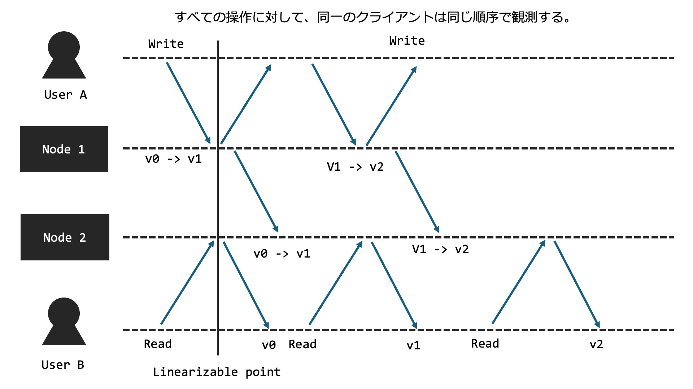

# 分散システムにおける一貫性

この章では分散システムにおける一貫性について説明します。
分散システムにおいて重要な事項はデータの複製（レプリケーション）です。

そしてこの複製されたデータがどのようにクライアントに観測されるかどうかを一貫性と言います。
さらにどのように観測されるべきかをモデル化することができ、これを一貫性モデルと言います。

# 一貫性の種類

一貫性は二つの観点が存在する。
まず、どのクライアントも一意の操作が観測できるというデータ中心一貫性モデル（data centric consistency model）である。
だが、広域に計算機が分散し、それらを協調するようなシステムでは、データ中心一貫性モデルを達成することが困難な場合もある。
そこで、クライアント視点から見たときに、一意の操作が観測できるという一貫性モデルであるクライアント中心一貫性モデル（client centric consistency model）が定義された。これはシステム全体では一貫性が保てていない時間もあるが、ある一つのクライアントからは一貫性があるように見えるようにするというモデルである。

正直言葉で言われてもわからないので、具体的なモデルを見てみよう！

- クライアント中心一貫性モデル（client centric consistency model）
    - 結果整合性（Eventual Consistency）
    - 因果一貫性（Causal Consistency）

- データ中心一貫性モデル（data centric consistency model）
    - 逐次一貫性（Sequential Consistency）
    - 線形化可能性（Linearizability）

## 結果整合性（Eventual Consistency）
結果整合性は、結果整合性モデルでは、システムの全てのノードが最終的には同じデータの状態に到達することを保証する。すなわち全てのプロセスは同じ順序で操作を観測できない場合もあり、即時に一貫性が保たれることは保証しない。データの更新がすべてのノードに伝播するのに時間がかかるかもしれないが、十分な時間が経過すれば、全てのノードが一貫した状態を持つ。もっとも緩い居完成モデルである

## 因果一貫性（Causal Consistency）
因果一貫性は、因果関係をもつ操作（書き込み）がシステム全体で一つの一貫した順序で実行されることを保証するモデルである。すなわち「ある書き込みが他の操作に依存している場合、その依存関係を保持する」ことを保証します。全てのプロセスは、因果関係が定められた書き込みに関しては同じ順序を観測する。だが同時に行われる操作の順序については保証しない。

**Advanced:**
因果一貫性はさらに４つの一貫性に分離することができる。

- モノトニック読み取り一貫性(monotonic-read consistency):
あるクライアントがノードから値を読み込むと、同クライアントによる以降の読み込み操作では、常に同じ値かより新しい値が読み込まれる。

- モノトニック書き込み一貫性(monotonic-write consistency):
あるクライアントの書き込み操作は、同クライアントによる後続の書き込み操作よりも前に完了している。

- 書き込み後読み取り一貫性(read-your-write consistency):
あるクライアントによる書き込み操作の結果は、同クライアントによる後続の読み取り操作で必ず観測される。

- 読み取り後続書き込み(write-follow-read consistency):
読み取り操作に後続する書き込み操作は、常に前回の読み取り操作時と同じか、より新しい値に対して行われることが保証されている。

## 逐次一貫性（Sequential Consistency）
逐次一貫性は、全ての操作がシステム全体で一つの一貫した順序で実行されることを保証するモデルである。すなわち全てのプロセスは同じ順序で操作を観測する。だがその操作が操作がいつ行われるのかはノードによって異なる。つまり実時間はクライアントがアクセスするノードによって異なる可能性がある。
逐次的一貫性では、すべての書き込みはすべてのプロセスで同じ順序で観測される。因果的一貫性では、因果的に関連する書き込みは同じ順序で観測される。したがって逐次的一貫性の要件が満たされていれば、この因果的一貫性の要件は確実に満たされる。

## 線形化可能性（Linearizability）
線形化可能性は、全ての操作が実際に起こった瞬間に一意の順序で実行されたかのように見えることを保証する。すなわち実時間に基づき、すべてのプロセスは同じ順序で書き込みが実行されたことを観測する。最も厳しい一貫性モデルである。実時間の制約を排除した一貫性モデルが逐次一貫性であるともいえる。

一般に即座に（遅延が0秒）で更新データを他のノードに反映させることは不可能です。したがって、プライマリーノードとセカンダリーノード分けて、すべての操作はプライマリーノードに送り、読み込みもプライマリーノードから行うようにすれば線形化可能性は達成されます。Raftは線形化可能性を保証します。

## どの一貫性モデルが良いのか？
一概に良いというと、今の文脈では線形化可能性が一番良さそうに見えます。ですが、システム全体で考えると必ずしも線形化可能性が良い選択になるとは限りません。シーケンシャルダイアグラムの通り、線形化可能性を実現するためには、ネットワークの遅延が０の場合、プライマリーセカンダリー構成にする場合、など極端な前提が必要なのです。これらの前提を達成するためには膨大なコストが必要なほか、前提を達成することが不可能な場合がほとんどです。したがって、設計するシステムに応じて適切な一貫性モデルを選択することが大切です。
例えばAmazonの[DynamoDB](https://aws.amazon.com/jp/dynamodb/)は結果整合性を保証します。ですが、冗長性を担保できたり、スループットを増加させたり、レイテンシを低くすることができます。

## おことわり
一部、図が適切ではないほか下手です。一回時間の都合上、お手上げ。

# 参考文献
- 分散システム 原理とパラダイム
- https://qiita.com/kumagi/items/3867862c6be65328f89c
- https://techblog.yahoo.co.jp/architecture/2015-04-ditributed-consistency/
- https://www.alexdebrie.com/posts/dynamodb-eventual-consistency/
- https://www.sraoss.co.jp/tech-blog/db-special-lecture/masunaga-db-special-lecture-11/
- https://www-higashi.ist.osaka-u.ac.jp/~nakata/mobile-cp/chap-06j-1.pdf
- https://christina04.hatenablog.com/entry/causal-consistency