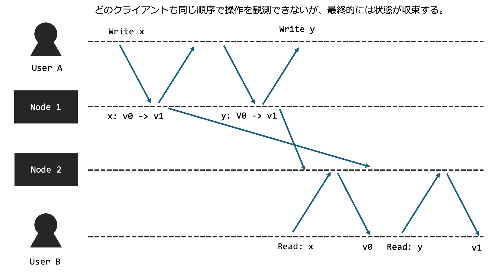
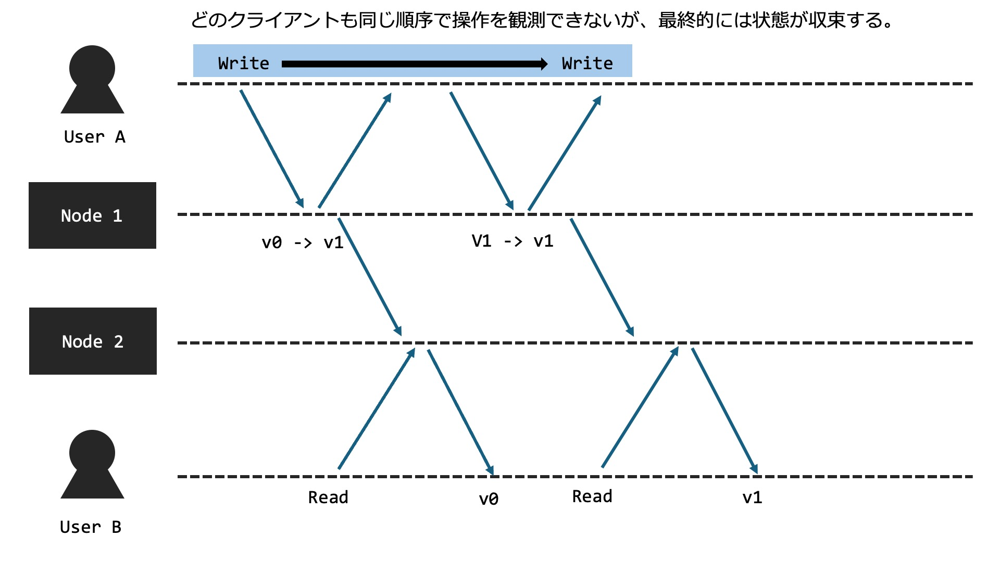
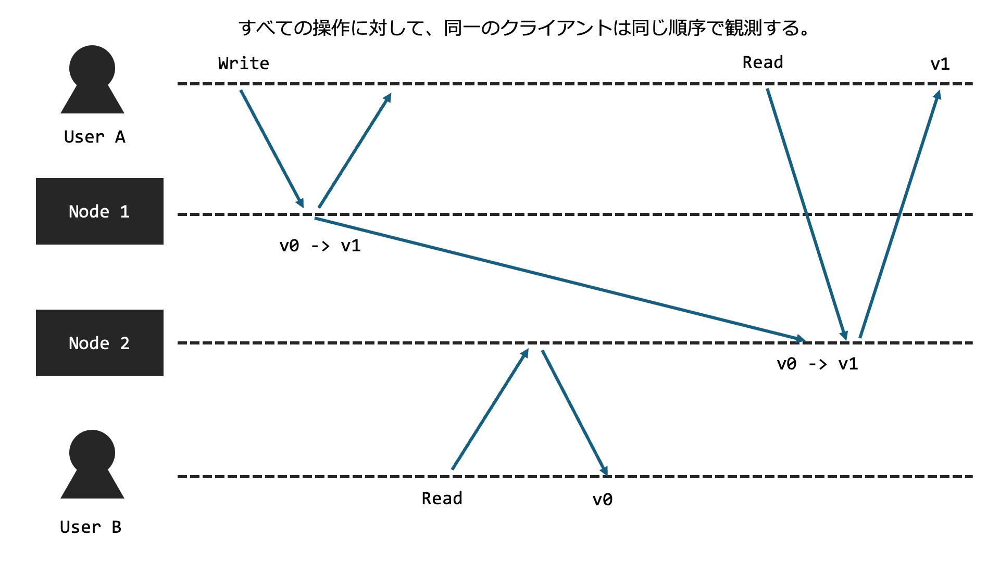
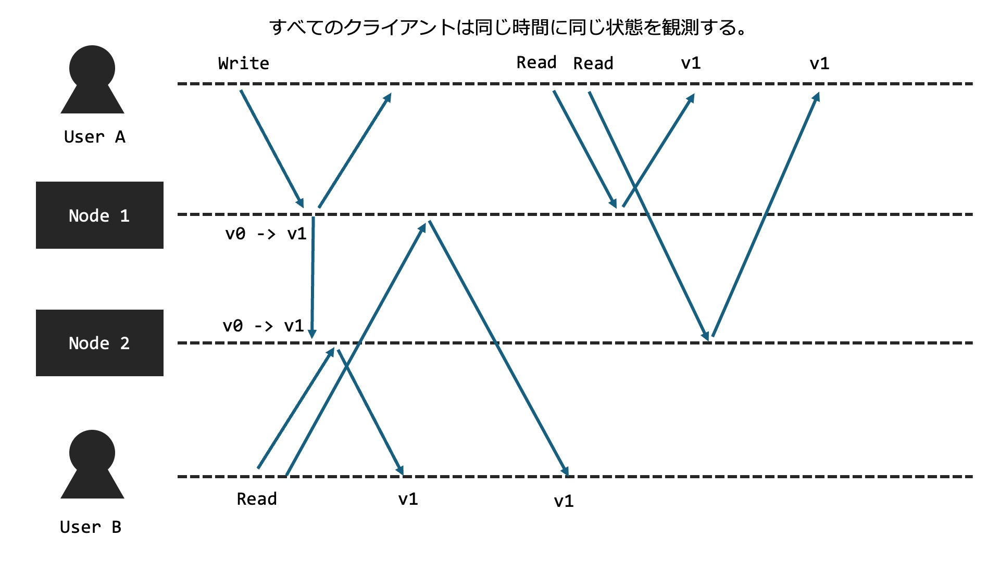

# 分散システムにおける一貫性

この章では分散システムにおける一貫性について説明します。
分散システムにおいて重要な事項はデータの複製（レプリケーション）です。

そしてこの複製されたデータがどのようにクライアントに観測されるかどうかを一貫性と言います。
さらにどのように観測されるべきかをモデル化することができ、これを一貫性モデルと言います。

一貫性モデルは様々存在しますが、ここでは代表的な一貫性モデルを４つ取り上げます。
一貫性には二つの観点が存在する。
それはあるクライアント視点から見たときに、一意の操作が観測できるという一貫性モデルであるクライアント中心一貫性モデル（client centric consistency model）。
そして、実時間で見たときに、一意の操作が観測できるという一貫性モデルである。

正直言葉で言われてもわからないので、具体的なモデルを見てみよう！

- クライアント中心一貫性モデル（client centric consistency model）
    - 結果整合性（Eventual Consistency）
    - 因果一貫性（Causal Consistency）
    - 逐次一貫性（Sequential Consistency）

- データ中心一貫性モデル（data centric consistency model）
    -  線形化可能性（Linearizability）

## 結果整合性（Eventual Consistency）
結果整合性は、最も緩やかな一貫性モデルの一つ。結果整合性モデルでは、システムの全てのノードが最終的には同じデータの状態に到達することを保証する。だが、即時に一貫性が保たれることは保証しない。すなわち、データの更新がすべてのノードに伝播するのに時間がかかるかもしれないが、十分な時間が経過すれば、全てのノードが一貫した状態を持つ。

## 因果一貫性（Causal Consistency）
因果一貫性は、操作の因果関係に基づく一貫性モデルです。このモデルは、「ある操作が他の操作に依存している場合、その依存関係を保持する」ことを保証します。全てのプロセスは、因果関係が定められた操作に関しては同じ順序を観測する。だが同時に行われる操作の順序については保証しない。

## 逐次一貫性（Sequential Consistency）
逐次一貫性は、分散システムにおける全ての操作がシステム全体で一つの一貫した順序で実行されることを保証するモデルである。全てのプロセスは同じ順序で操作を観測する。だがその操作が操作がいつ行われるのかはノードによって異なる。つまり実時間はクライアントがアクセスするノードによって異なる可能性がある。

## 線形化可能性（Linearizability）
全ての操作が実際に起こった瞬間に一意の順序で実行されたかのように見えることを保証する。最も厳しい一貫性モデルです。つまり実時間に基づき、クライアントの観測が変わる一貫性モデルである。

一般に即座に（遅延が0秒）で更新データを他のノードに反映させることは不可能です。したがって、プライマリーノードとセカンダリーノード分けて、すべての操作はプライマリーノードに送り、読み込みもプライマリーノードから行うようにすれば線形化可能性は達成されます。Raftは線形化可能性を保証します。

## どの一貫性モデルが良いのか？
一概に良いというと、今の文脈では線形化可能性が一番良さそうに見えます。ですが、システム全体で考えると必ずしも線形化可能性が良い選択になるとは限りません。シーケンシャルダイアグラムの通り、線形化可能性を実現するためには、ネットワークの遅延が０の場合、プライマリーセカンダリー構成にする場合、など極端な前提が必要なのです。これらの前提を達成するためには膨大なコストが必要なほか、前提を達成することが不可能な場合がほとんどです。したがって、設計するシステムに応じて適切な一貫性モデルを選択することが大切です。
例えばAmazonの[DynamoDB](https://aws.amazon.com/jp/dynamodb/)は結果整合性を保証します。ですが、冗長性を担保できたり、スループットを増加させたり、レイテンシを低くすることができます。

# 参考文献
- 分散システム 原理とパラダイム
- https://qiita.com/kumagi/items/3867862c6be65328f89c
- https://techblog.yahoo.co.jp/architecture/2015-04-ditributed-consistency/
- https://www.alexdebrie.com/posts/dynamodb-eventual-consistency/
- https://www.sraoss.co.jp/tech-blog/db-special-lecture/masunaga-db-special-lecture-11/