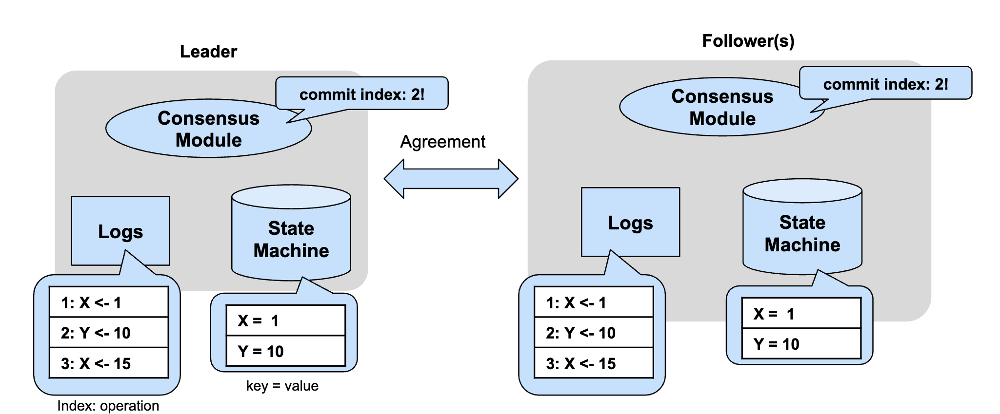

# Raft
Raftはノード間でステートマシンの一貫性を担保するためのアルゴリズムです。
このアルゴリズムは分散型データベースやブロックチェーン、コントロールプレーンなど、様々なデータストアで利活用されています。

元論文: [In Search of an Understandable Consensus Algorithm - USENIX'14](https://www.usenix.org/system/files/conference/atc14/atc14-paper-ongaro.pdf)

# Raftの構造
Raftは主に3つのパーツから成り立っています。
- コンセンサスモジュール: 他のノードと通信を行い、合意アルゴリズムを実行する。
- ログ: 合意を獲得した/獲得するログエントリを保存する。
- ステートマシン: 合意を獲得したログエントリを実行したキーバリューストア。ステートマシンの状態はすべてのノードで同じになる(ただし、ノードがアクティブな場合に限る)。

# ノードの状態
1. **フォロワー（Follower）**
   - クラスター内のデフォルトの状態で、リーダーからの指示を待ち、リーダーや候補者になるまで受動的な役割を果たします。

2. **候補者（Candidate）**
   - リーダー選挙に参加するためにフォロワーから昇格した状態で、リーダーになることを目指して他のノードに投票を依頼します。

3. **リーダー（Leader）**
   - クラスター内の単一のノードで、クライアントからのリクエストを処理し、フォロワーにログエントリを複製してクラスター全体の操作を調整します。

一般にフォロワー -> 候補者 -> リーダーという順に推移します。

#　Raftの処理
Raftはおもに2つの処理から構成されます。
- ログエントリーの追加: ログエントリーの合意をノード間で取得し、ステートマシンにログエントリを適応する一連のプロセス
- リーダー選挙: Raftでは合意にリーダーというノードが必要となる。そのノードをクラスター（ノードの集合）から決める一連のプロセス

# ログエントリーの追加
ログエントリーの合意をノード間で取得し、ステートマシンにログエントリを適応する一連のプロセスを説明します。

## 手順

1. **クライアントからリーダーにエントリを送信する**
   - クライアントは、リーダーとなっているノードにエントリを送信します。

2. **リーダーのログにエントリを追加する**
   - リーダーは受け取ったエントリを自身のログに追加します。

3. **エントリをフォロワーに送信する**
   - リーダーは、ログに追加したエントリをすべてのフォロワーに送信します。

4. **フォロワーのログにエントリを追加する**
   - フォロワーは、リーダーから受け取ったエントリを自身のログに追加します。

5. **リーダーに対して成功または失敗を応答する**
   - フォロワーは、エントリが正常にログに追加されたかどうかをリーダーに通知します。

6. **クライアントに応答する**
   - リーダーは、フォロワーからの応答を受け取り、エントリがコミットされたかどうかをクライアントに返答します。

7. **リーダーの状態機械にエントリをコミットする**
   - リーダーは、ログエントリが確定したと判断すると、それを自身の状態機械にコミットします。

8. **フォロワーにログがコミットされたことを通知する**
   - リーダーは、ログエントリがコミットされたことをフォロワーに通知します。

9. **フォロワーの状態機械にエントリをコミットする**
   - フォロワーは、リーダーからの通知を受け取り、自身の状態機械にエントリをコミットします。

# リーダー選挙
リーダーノードをクラスター（ノードの集合）から決める一連のプロセスを説明します。

## 手順
1. **リーダーの不在を検知する**
   - フォロワー（Follower）ノードは、一定期間リーダーからのハートビート（心拍）メッセージを受信しない場合、リーダーがダウンしたか、ネットワーク障害が発生したと判断します。

2. **フォロワーから候補者（Candidate）に昇格する**
   - ハートビートの欠如を検知したフォロワーは、自身を候補者（Candidate）に昇格させます。候補者はリーダーになることを試みます。

3. **選挙タイムアウトのリセットと任期の増加**
   - 候補者に昇格すると、選挙タイムアウトをランダムな期間にリセットし、自身の任期（term）を1つ増やします。

4. **他のノードに投票要求を送信する**
   - 候補者は、他のすべてのノードに対して投票要求（RequestVote RPC）を送信します。この要求には、候補者の任期と自身のログ情報が含まれます。

5. **他のノードの応答を受け取る**
   - 他のノードは、投票要求を受け取ると、自身の状況に応じて投票するか否かを決定します。投票の条件は以下の通りです：
   - そのノードがまだ投票しておらず
   - 候補者のログがそのノードのログと同じかそれより新しい場合

6. **過半数の票を獲得する**
   - 候補者が過半数の票を獲得した場合、その候補者はリーダー（Leader）に選出されます。

7. **リーダーとしての活動を開始する**
   - 新しいリーダーは、フォロワーに対して定期的にハートビートメッセージを送信し、リーダーとしての地位を保持し続けます。

8. **他の候補者がリーダーを発見する**
   - 他の候補者が過半数の票を獲得できなかった場合、リーダーとして選出されたノードからのハートビートを受け取ると、フォロワーに戻ります。

9. **タイムアウトにより新たな選挙が発生する可能性**
   - 選挙が終了せず、候補者が過半数の票を得られない場合は、新しい選挙タイムアウトが発生し、新たな選挙が開始される可能性があります。これにより、選挙がリーダーを選出するまで繰り返されます。

10. **リーダーの安定化**
   - リーダーが選出され、フォロワーにハートビートを送り続けることで、クラスタの安定性を維持します。新たなリーダーが継続してリーダーシップを発揮することで、リーダー選出プロセスが終了します。
