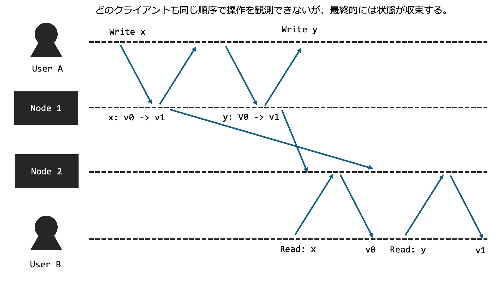
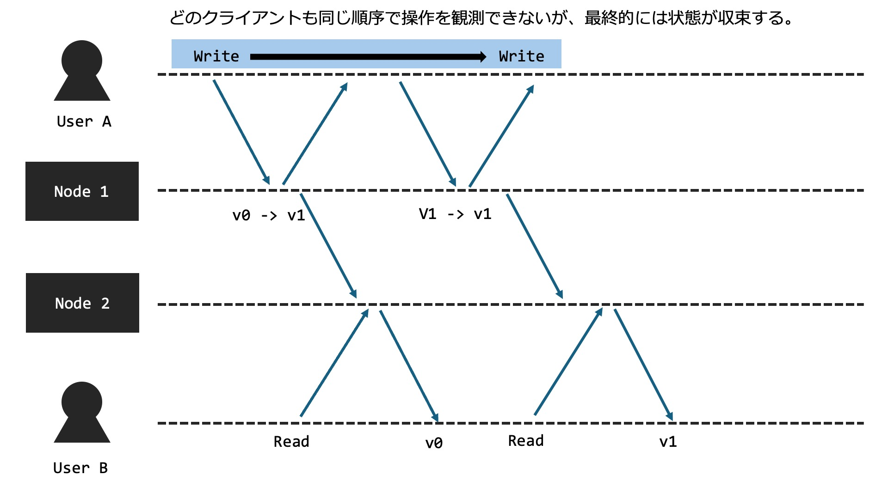
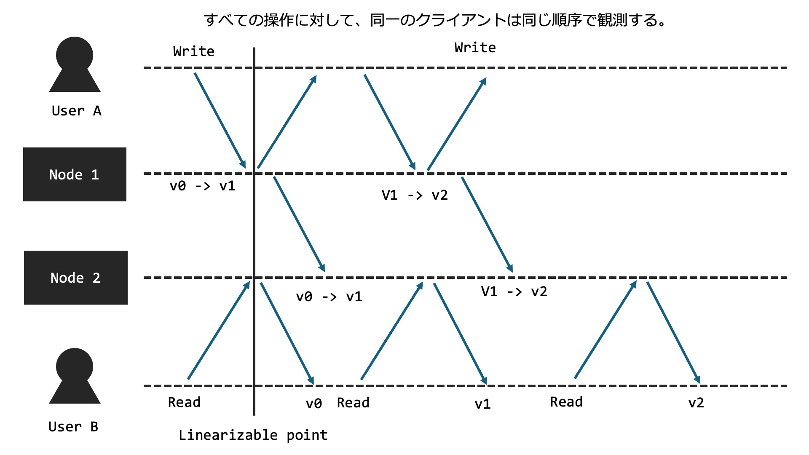

# 分散システムにおける一貫性

**Riku Mochizuki**  
moz at sfc.keio.ac.jp

---

# 分散システムにおける一貫性

この章では分散システムにおける一貫性について説明します。  
分散システムにおいて重要な事項はデータの複製（レプリケーション）です。

この複製されたデータがどのようにクライアントに観測されるかを一貫性といいます。  
さらにどのように観測されるべきかをモデル化することができ、これを一貫性モデルといいます。

---

# 一貫性の種類

一貫性には二つの観点があります。

1. **データ中心一貫性モデル（Data Centric Consistency Model）**  
   どのクライアントも一意の操作が観測できることを保証します。  
   しかし、広域に計算機が分散し、それらを協調するようなシステムでは、達成が困難な場合もあります。

2. **クライアント中心一貫性モデル（Client Centric Consistency Model）**  
   クライアント視点で一意の操作が観測できることを保証します。  
   システム全体では一貫性が保てていない時間もありますが、特定のクライアントからは一貫性があるように見えます。

---

# 一貫性モデルの具体例

- **クライアント中心一貫性モデル（Client Centric Consistency Model）**
  - 結果整合性（Eventual Consistency）
  - 因果一貫性（Causal Consistency）

- **データ中心一貫性モデル（Data Centric Consistency Model）**
  - 逐次一貫性（Sequential Consistency）
  - 線形化可能性（Linearizability）

---

## 結果整合性（Eventual Consistency）

結果整合性モデルでは、全てのノードが最終的に同じデータの状態に到達することを保証します。  
操作の順序が一致しない場合もありますが、十分な時間が経過すれば全てのノードが一貫した状態になります。

---

---

## 因果一貫性（Causal Consistency）

因果一貫性は、因果関係を持つ操作が一貫した順序で実行されることを保証するモデルです。  
因果関係のある書き込みは同じ順序で観測されますが、同時に行われる操作の順序は保証されません。

---

---

## 因果一貫性の詳細

因果一貫性はさらに4つの一貫性に分けられます：

- **モノトニック読み取り一貫性 (Monotonic-Read Consistency):**  
  クライアントがノードから値を読み込むと、以降の読み込みでは同じ値か新しい値が読み込まれる。

- **モノトニック書き込み一貫性 (Monotonic-Write Consistency):**  
  クライアントの書き込み操作は、後続の書き込み操作よりも前に完了している。

- **書き込み後読み取り一貫性 (Read-Your-Write Consistency):**  
  クライアントの書き込み操作の結果は、後続の読み取り操作で必ず観測される。

- **読み取り後続書き込み (Write-Follow-Read Consistency):**  
  読み取り操作に後続する書き込み操作は、常に前回の読み取り操作時と同じか、新しい値に対して行われる。

---

## 逐次一貫性（Sequential Consistency）

逐次一貫性は、全ての操作がシステム全体で一貫した順序で実行されることを保証します。  
全てのプロセスは同じ順序で操作を観測しますが、操作がいつ行われるかはノードによって異なる場合があります。

---

---

## 線形化可能性（Linearizability）

線形化可能性は、全ての操作が実際に起こった瞬間に一意の順序で実行されたかのように見えることを保証します。  
すべてのプロセスは実時間に基づいて同じ順序で書き込みが実行されたことを観測します。

---

---

## どの一貫性モデルが良いのか？

一概に良いとは言えず、システム全体で考えると必ずしも線形化可能性が良い選択とは限りません。  
設計するシステムに応じて適切な一貫性モデルを選択することが大切です。  
例えばAmazonの[DynamoDB](https://aws.amazon.com/jp/dynamodb/)は結果整合性を保証します。

---

## おことわり

一部、図が適切ではない場合があります。ご了承ください。

---

# 参考文献

- 分散システム 原理とパラダイム
- [Qiita: 分散システムにおける一貫性](https://qiita.com/kumagi/items/3867862c6be65328f89c)
- [Yahoo Tech Blog: 一貫性モデル](https://techblog.yahoo.co.jp/architecture/2015-04-ditributed-consistency/)
- [DynamoDB Eventual Consistency](https://www.alexdebrie.com/posts/dynamodb-eventual-consistency/)
- その他多数...

