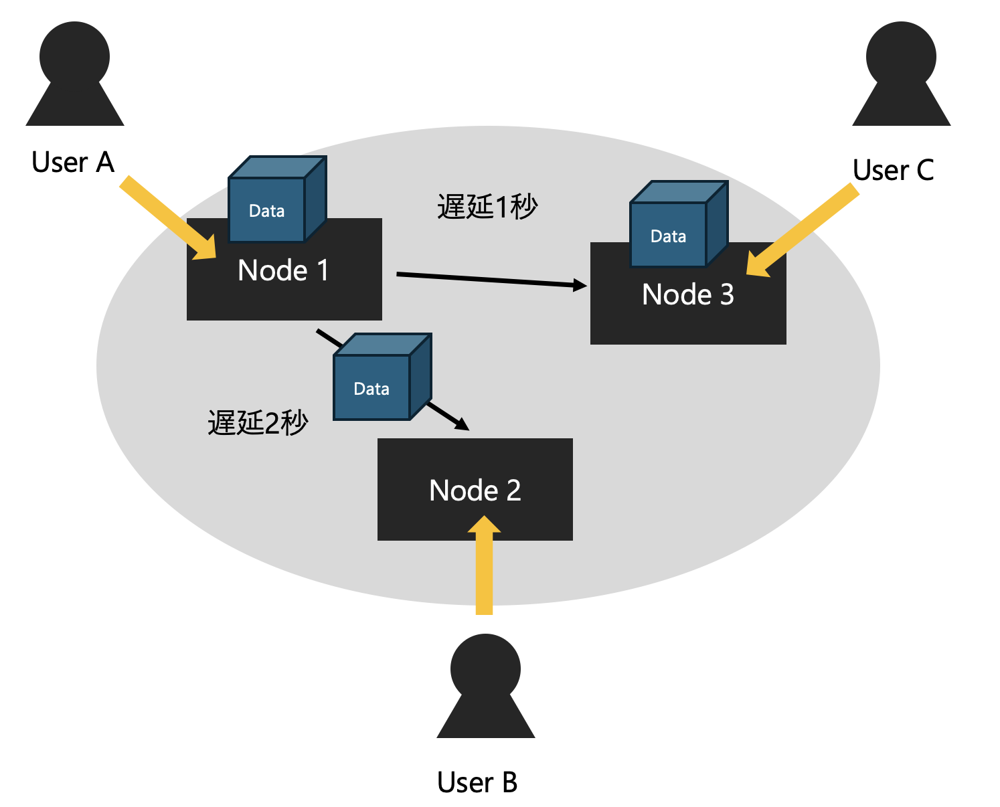

# 分散システムにおける一貫性

**Riku Mochizuki**  
moz at sfc.keio.ac.jp

---

## 分散システムにおける一貫性

この章では分散システムにおける一貫性について説明します。  
分散システムにおいて重要な機能は、データの複製（レプリケーション）です。
また次のセクションでは一貫性の議論と共にデータの複製プロトコルであるRaftを取り上げます。

---

## データーの複製
情報システムでは故障(fault)が発生します。
それはソフトウェア的な要因もあればハードウェア的な要因に分けられます。さらにその原因は自然災害、ヒューマン、経年劣化などさまざまです。

したがってそのような**障害が起こらないシステムを作ることは不可能**です。

---
## 情報システムに対する信頼

情報システムの可用性（ほしいときにほしいデータを手に入れられる）を担保するためには、そのような障害が起きる前提を置き、システムを設計しなければなりません。

その設計のテクニックとしてよく使われる方法が**データの複製**です。

---
## データの複製
可用性を高めるために、一般に異なるコンピュータ（ノード）にデータを複製します。このような冗長構成にすることで、何か一つのノードが障害でダウンしてしまっても、ほかのノードが利用可能できます。

したがってシステム全体で見たときに可用性が担保できるわけです。

---
## データの複製
データを複製するためにはノード間の通信が必要です。
このような通信には遅延が起こります。さらにthe Internetなどのベストエフォート型ネットワークを用いる場合、データが届かなかったり、データが到着する順番が異なったりと予期せぬイベントが発生します。

---

## データの複製
Node1からNode{2,3}に複製する場合、それぞれの経路はスペックが異なります。

---

## データの複製
Node１がDataをNode{2,3}に送ったタイミング（時間）を $t$ (単位：秒)とします。 $t+1$秒ではNode3にはデータが届いている（ユーザーから見える）のにNode2にはまだデータが届いていないためユーザから見れません。

---

## データの複製

したがってある実時間において、各ノードの状態は異なります。

また、同じ時間でもクライアントによってはシステム（クラスタ内の任意のノード）から得た値がほかのクライアントと異なる場合もあります。

---

## 分散システムにおける一貫性

データがどのように複製されるか、それらの複製をクライアントはどのように観測するかを**一貫性**といいます。  
さらにどのように複製/観測されるべきかをモデル化することができ、これを**一貫性モデル**といいます。

---
# 一貫性モデルの種類

一貫性には二つの観点があります。

1. **データ中心一貫性モデル（Data Centric Consistency Model）**  
   どのクライアントも一意の操作が観測できることを保証します。  
   しかし、広域に計算機が分散し、それらを協調するようなシステムでは、達成が困難な場合もあります。

2. **クライアント中心一貫性モデル（Client Centric Consistency Model）**  
   クライアント視点で一意の操作が観測できることを保証します。  
   システム全体では一貫性が保てていない時間もありますが、特定のクライアントからは一貫性があるように見えます。

---

# 一貫性モデルの具体例

- **クライアント中心一貫性モデル（Client Centric Consistency Model）**
  - 結果整合性（Eventual Consistency）
  - 因果一貫性（Causal Consistency）

- **データ中心一貫性モデル（Data Centric Consistency Model）**
  - 逐次一貫性（Sequential Consistency）
  - 線形化可能性（Linearizability）

---

## 結果整合性（Eventual Consistency）

結果整合性モデルでは、全てのノードが最終的に同じデータの状態に到達することを保証します。  
操作の順序が一致しない場合もありますが、十分な時間が経過すれば全てのノードが一貫した状態になります。

---

---

## 因果一貫性（Causal Consistency）

因果一貫性は、因果関係を持つ操作が一貫した順序で実行されることを保証するモデルです。  
因果関係のある書き込みは同じ順序で観測されますが、同時に行われる操作の順序は保証されません。

---

---

## 因果一貫性の詳細

- **モノトニック読み取り一貫性 (Monotonic-Read Consistency):**  
  クライアントがノードから値を読み込むと、以降の読み込みでは同じ値か新しい値が読み込まれる。

- **モノトニック書き込み一貫性 (Monotonic-Write Consistency):**  
  クライアントの書き込み操作は、後続の書き込み操作よりも前に完了している。

- **書き込み後読み取り一貫性 (Read-Your-Write Consistency):**  
  クライアントの書き込み操作の結果は、後続の読み取り操作で必ず観測される。

- **読み取り後続書き込み (Write-Follow-Read Consistency):**  
  読み取り操作に後続する書き込み操作は、常に前回の読み取り操作時と同じか、新しい値に対して行われる。

---

## 逐次一貫性（Sequential Consistency）

逐次一貫性は、全ての操作がシステム全体で一貫した順序で実行されることを保証します。  
全てのプロセスは同じ順序で操作を観測しますが、操作がいつ行われるかはノードによって異なる場合があります。

---

---

## 線形化可能性（Linearizability）

線形化可能性は、全ての操作が実際に起こった瞬間に一意の順序で実行されたかのように見えることを保証します。  
すべてのプロセスは実時間に基づいて同じ順序で書き込みが実行されたことを観測します。

---

---
## 線形化可能性の難しさ

一般に即座に（遅延が0秒）で更新データを他のノードに反映させることは不可能です。

したがって、プライマリーノードとセカンダリーノード分けて、すべての操作はプライマリーノードに送り、読み込みもプライマリーノードから行うようにすれば線形化可能性は達成されます。Raftは線形化可能性を保証します。

---

## 一貫性の分類

一貫性モデルは以下のように分類できる。

|                    | 実時間の一貫性あり | 実時間の一貫性なし |
|--------------------|------------------|------------------|
| 操作の順序の一貫性あり  | 線形化可能性      | 逐次一貫性, 因果一貫性 (一部の操作群)            |
| 操作の順序の一貫性なし  |               | 結果整合性            |

---

## どの一貫性モデルが良いのか？
一概に良いというと、今の文脈では線形化可能性が一番良さそうに見えます。

ですが、システム全体で考えると必ずしも線形化可能性が良い選択になるとは限りません。

---
## どの一貫性モデルが良いのか？
シーケンシャルダイアグラムの通り、線形化可能性を実現するためには、ネットワークの遅延が０の場合、プライマリーセカンダリー構成にする場合、など極端な前提が必要なのです。

これらの前提を達成するためには膨大なコストが必要なほか、前提を達成することが不可能な場合がほとんどです。したがって、設計するシステムに応じて適切な一貫性モデルを選択することが大切です。

例えばAmazonの[DynamoDB](https://aws.amazon.com/jp/dynamodb/)は結果整合性を保証します。ですが、冗長性を担保できたり、スループットを増加させたり、レイテンシを低くすることができます。

---

# 参考文献

- 分散システム 原理とパラダイム
- https://qiita.com/kumagi/items/3867862c6be65328f89c
- https://techblog.yahoo.co.jp/architecture/2015-04-ditributed-consistency/
- https://www.alexdebrie.com/posts/dynamodb-eventual-consistency/
- https://www.sraoss.co.jp/tech-blog/db-special-lecture/masunaga-db-special-lecture-11/
- https://www-higashi.ist.osaka-u.ac.jp/~nakata/mobile-cp/chap-06j-1.pdf
- https://christina04.hatenablog.com/entry/causal-consistency

