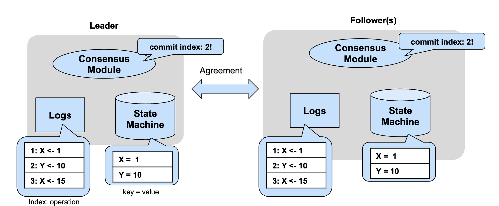
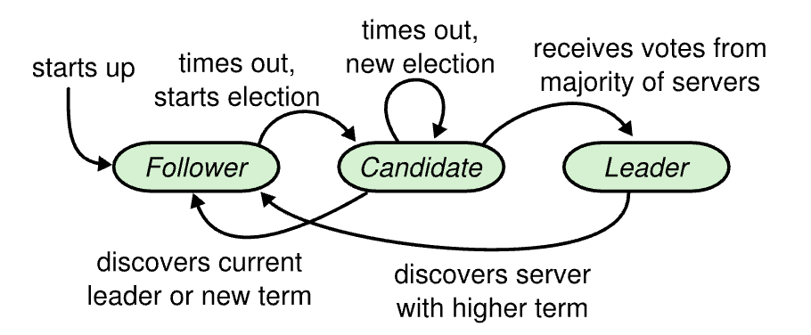
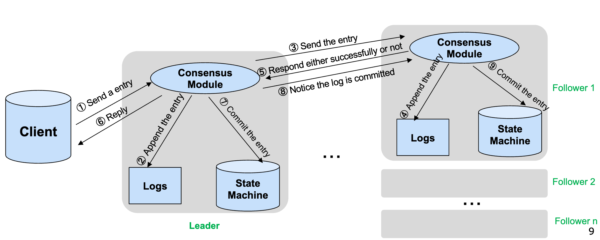
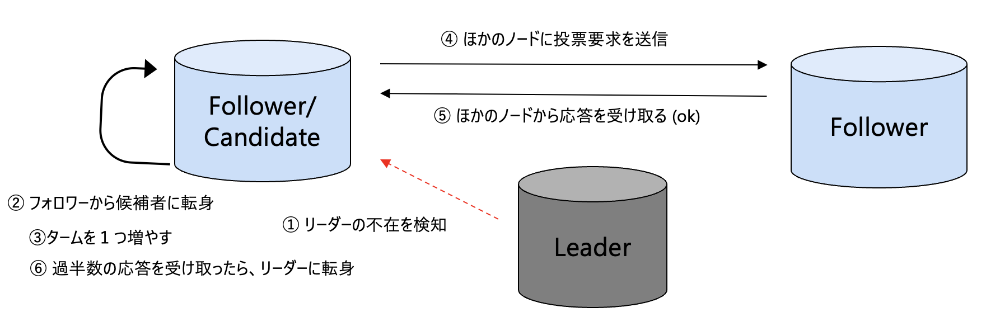
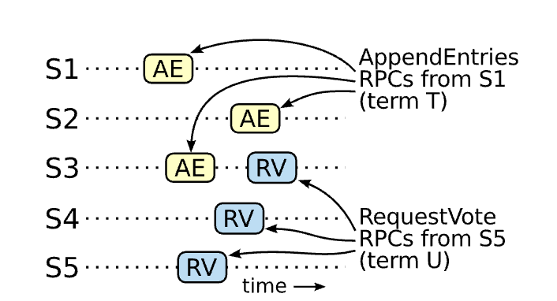

# Raft入門

**Riku Mochizuki**  
moz at sfc.keio.ac.jp

---

## Raft

Raftはノード間でステートマシンの一貫性を担保するためのアルゴリズムです。  
Raftは線形化可能性を保証します。  
このアルゴリズムは分散型データベースやブロックチェーン、コントロールプレーンなど、様々なデータストアで利活用されています。

元論文: [In Search of an Understandable Consensus Algorithm - USENIX'14](https://www.usenix.org/system/files/conference/atc14/atc14-paper-ongaro.pdf)

---

## Raftの構造

Raftは主に3つのパーツから成り立っています。

1. **コンセンサスモジュール**: 他のノードと通信を行い、合意アルゴリズムを実行する。
2. **ログ**: 合意を獲得した/獲得するログエントリを保存する。
3. **ステートマシン**: 合意を獲得したログエントリを実行したキーバリューストア。ステートマシンの状態はすべてのノードで同じになる(ただし、ノードがアクティブな場合に限る)。

---

---

## ノードの状態

1. **フォロワー（Follower）**  
   クラスター内のデフォルトの状態で、リーダーからの指示を待ち、リーダーや候補者になるまで受動的な役割を果たします。

2. **候補者（Candidate）**  
   リーダー選挙に参加するためにフォロワーから昇格した状態で、リーダーになることを目指して他のノードに投票を依頼します。

3. **リーダー（Leader）**  
   クラスター内の単一のノードで、クライアントからのリクエストを処理し、フォロワーにログエントリを複製してクラスター全体の操作を調整します。

---

## ノードの状態

一般にフォロワー -> 候補者 -> リーダーという順に推移します。

---

## Raftの処理

Raftは主に2つの処理から構成されます。

- **ログエントリーの追加**: ログエントリーの合意をノード間で取得し、ステートマシンにログエントリを適用する一連のプロセス。
- **リーダー選挙**: Raftでは合意にリーダーというノードが必要となる。そのノードをクラスター（ノードの集合）から決める一連のプロセス。

---

# ログエントリーの追加

ログエントリーの合意をノード間で取得し、ステートマシンにログエントリを適用する一連のプロセスを説明します。

---

---

## ログエントリーの追加 - 手順 1-3

1. **クライアントからリーダーにエントリを送信する**  
   クライアントは、リーダーとなっているノードにエントリを送信します。

2. **リーダーのログにエントリを追加する**  
   リーダーは受け取ったエントリを自身のログに追加します。

3. **エントリをフォロワーに送信する**  
   リーダーは、ログに追加したエントリをすべてのフォロワーに送信します。

---

## ログエントリーの追加 - 手順 4-6

4. **フォロワーのログにエントリを追加する**  
   フォロワーは、リーダーから受け取ったエントリを自身のログに追加します。

5. **リーダーに対して成功または失敗を応答する**  
   フォロワーは、エントリが正常にログに追加されたかどうかをリーダーに通知します。

6. **クライアントに応答する**  
   リーダーは、フォロワーからの応答を受け取り、エントリがコミットされたかどうかをクライアントに返答します。

---

## ログエントリーの追加 - 手順 7-9

7. **リーダーの状態機械にエントリをコミットする**  
   リーダーは、ログエントリが確定したと判断すると、それを自身の状態機械にコミットします。

8. **フォロワーにログがコミットされたことを通知する**  
   リーダーは、ログエントリがコミットされたことをフォロワーに通知します。

9. **フォロワーの状態機械にエントリをコミットする**  
   フォロワーは、リーダーからの通知を受け取り、自身の状態機械にエントリをコミットします。

---

## リーダー選挙

リーダーノードをクラスター（ノードの集合）から決める一連のプロセスを説明します。

---

---

## リーダー選挙 - 手順 1-3

1. **リーダーの不在を検知する**  
   フォロワーノードは、一定期間リーダーからのハートビートメッセージを受信しない場合、リーダーがダウンしたかネットワーク障害が発生したと判断します。

2. **フォロワーから候補者に昇格する**  
   ハートビートの欠如を検知したフォロワーは、自身を候補者に昇格させます。候補者はリーダーになることを試みます。

3. **選挙タイムアウトのリセットと任期の増加**  
   候補者に昇格すると、選挙タイムアウトをランダムな期間にリセットし、自身のタームを1つ増やします。

---

## リーダー選挙 - 手順 4-6

4. **他のノードに投票要求を送信する**  
   候補者は、他のすべてのノードに対して投票要求を送信します。この要求には、候補者の任期と自身のログ情報が含まれます。

5. **他のノードの応答を受け取る**  
   他のノードは、投票要求を受け取ると、自身の状況に応じて投票するか否かを決定します。投票の条件は以下の通りです：  
   - そのノードがまだ投票しておらず  
   - 候補者のログがそのノードのログと同じかそれより新しい場合

6. **過半数の票を獲得し、リーダーに転身**  
   候補者が過半数の票を獲得した場合、その候補者はリーダーに選出されます。

---

## リーダー選挙 - 上手くいかないケース

- **タイムアウトにより新たな選挙が発生する可能性**  
   選挙が終了せず、候補者が過半数の票を得られない場合は、新しい選挙タイムアウトが発生し、新たな選挙が開始される可能性があります。これにより、選挙がリーダーを選出するまで繰り返されます。

---

## Raftの安全性

Raftは以下の安全性を満たします。

| プロパティ                | 説明                                                                                                                          |
|-----------------------------|-------------------------------------------------------------------------------------------------------------------------------|
| 選挙の安全性                | ある任期中に選ばれるリーダーは1つだけです。                                                                                   |
| リーダーの追記専用          | リーダーはログエントリを上書きしたり削除したりせず、新しいログエントリのみを追加します。                                         |
| ログの一致                  | 2つのログエントリが同じindexとtermを含んでいる場合、そのログエントリは指定されたインデックスまでのすべてのエントリで一致します。|
| リーダーの完全性            | ある任期中にコミットされたログエントリは、より高い任期のすべてのリーダーのログにも存在します。                                 |
| ステートマシンの安全性            | サーバーが特定のログインデックスでログエントリをステートマシンに適用した場合、他のサーバーが同じインデックスで異なるログエントリを適用することはありません。|

---

## Raftの安全性
### 選挙の安全性
リーダー選挙の手続きにより、あるTermではLeaderノードは一つしか選ばれない。
(ネットワークの分断によってクラスタ内にリーダーが二人以上生まれる場合はある)

### ステートマシンの安全性

### ログの一致
AppendEntriesでログの一貫性チェックを行い、一致しない場合はリーダーがフォロワーのログエントリを自身のログエントリに置き換える

---

## Raftの安全性 - リーダーの完全性

ログエントリが過半数のノードに伝搬されていれば、そのログは失われることはありません。かならず最新のログエントリをもつノードが一つ以上存在する。(リーダーの安全性の証明)

---
## Raftの安全性
### 選挙の安全性
リーダーの完全性によって必ず最新のログをコミットしたリーダーが選ばれる。したがってコミットされたログが一貫性を担保するために変更されることはない。

---
## Raftが保証する一貫性モデル
リーダーはログエントリにindexを付与し、フォロワー合意が得られたログエントリをindex順にステートマシンに適応する。
リーダーは適応したことをフォロワーに伝えることで、フォロワーはそのログをindex順にステートマシンに適応する。
したがってRaftはフォロワーから読み込む（フォロワーリード）ことを考えると逐次一貫性を満たす。
リーダーから読み込む場合は線形化可能性を満たす。

[フォロワーリードの問題について](https://www.pingcap.com/blog/doubling-system-read-throughput-with-only-26-lines-of-code/)

---

## シミュレーター

Raftの動作を視覚的に確認できるサイト:

- [raft-consensus-simulator](https://observablehq.com/@stwind/raft-consensus-simulator)
- [raft.github.io](https://raft.github.io/)

---

## おすすめ文献

- [Raft Presentation](https://www.slideshare.net/slideshow/raft-36155398/36155398#71)
